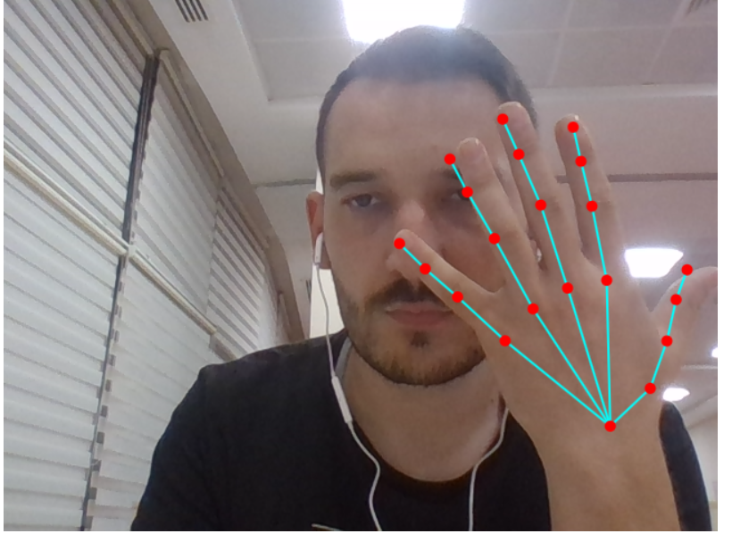
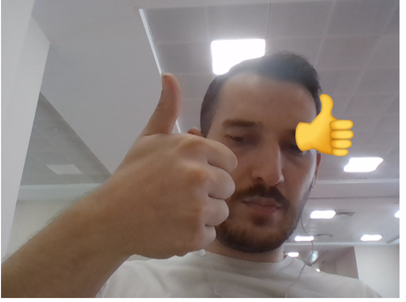
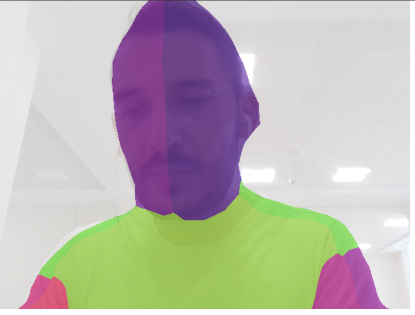

# Media Output Showcase

Aşağıda proje çıktıları görseller halinde iki sütun şeklinde gösterilmiştir:

<table>
  <tr>
    <td align="center">
      <strong>Hand Pose Output</strong> 
      
    </td>
    <td align="center">
      <strong>Gesture Detection</strong> 
      
    </td>
  </tr>
  <tr>
    <td align="center">
      <strong>Body Segmentation</strong> 
      
    </td>
    <td align="center">
      <strong>FaceMash</strong> 
      
    </td>
  </tr>
</table>
